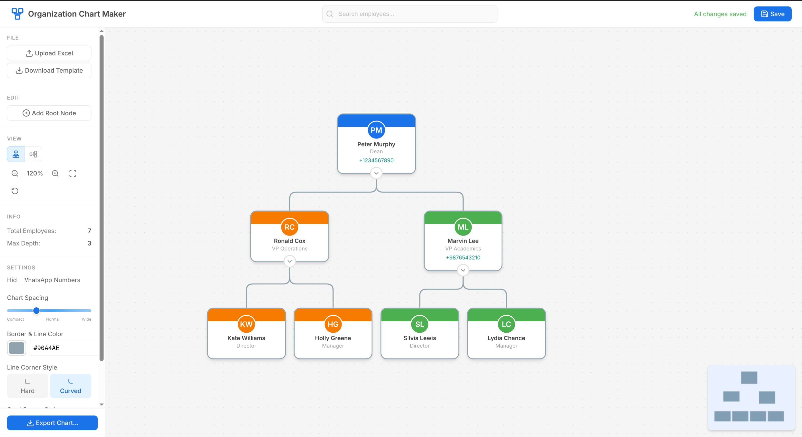

# Organization Chart Maker

A Flask-based web application for creating, editing, and visualizing organizational hierarchies from Excel data.



## Features

### 📊 Data Management
- **Excel Import/Export**: Load organizational data from `.xlsx` files
- **Live Editing**: Add, edit, and delete employees directly in the UI
- **Auto-save Tracking**: Visual indicator for unsaved changes
- **Data Validation**: Checks for circular references and invalid data

### 🎨 Visualization
- **Interactive Org Chart**: Beautiful, hierarchical visualization
- **Zoom & Pan**: Mouse wheel zoom, click-and-drag panning
- **Layout Options**: Vertical and horizontal layouts
- **Collapsible Nodes**: Expand/collapse subtrees
- **Color-coded Departments**: Visual distinction by department
- **Avatars**: Initials-based or custom image avatars

### ✏️ Editing
- **Click to Select**: Single click selects a node
- **Double-click to Edit**: Opens edit modal
- **Right-click Context Menu**: Quick access to all actions
- **Drag & Drop**: Drag employees to change their manager
- **Search**: Find employees by name, title, or department

### 📤 Export
- **PNG Export**: High-resolution image export
- **PDF Export**: Print-ready document export

## Tech Stack

- **Backend**: Python 3.8+, Flask 3.0
- **Frontend**: Vanilla JavaScript, HTML5, CSS3
- **Data**: openpyxl for Excel handling
- **Export**: Pillow, ReportLab for image/PDF generation

## Installation

### Prerequisites

- Python 3.8 or higher
- pip (Python package manager)

### Setup

1. **Clone or navigate to the project directory**:
   ```bash
   cd "Organization Chart Maker"
   ```

2. **Create a virtual environment** (recommended):
   ```bash
   python -m venv venv
   source venv/bin/activate  # On Windows: venv\Scripts\activate
   ```

3. **Install dependencies**:
   ```bash
   pip install -r requirements.txt
   ```

4. **Run the application**:
   ```bash
   python app.py
   ```

5. **Open in browser**:
   ```
   http://localhost:5000
   ```

## Excel File Format

The application expects an Excel file (`.xlsx`) with the following columns:

| Column | Required | Description |
|--------|----------|-------------|
| `employee_id` | Yes | Unique identifier for each employee |
| `name` | Yes | Employee's full name |
| `title` | Yes | Job title/position |
| `department` | Yes | Department name |
| `manager_id` | No | ID of the employee's manager (empty for CEO/root) |
| `avatar_url` | No | URL to avatar image |
| `color` | No | Hex color for the node header (e.g., `#1a73e8`) |

### Sample Excel Data

| employee_id | name | title | department | manager_id | avatar_url | color |
|-------------|------|-------|------------|------------|------------|-------|
| 1 | Peter Murphy | Dean | Executive | | | #1a73e8 |
| 2 | Ronald Cox | Auxiliary Staff | Support | 1 | | #f57c00 |
| 3 | Mike Fox | Director | Dean's Office | 1 | | #1a73e8 |

### Download Template

Click "Download Template" in the sidebar to get a pre-formatted Excel file.

## Project Structure

```
Organization Chart Maker/
├── app.py                 # Flask application (routes & API)
├── requirements.txt       # Python dependencies
├── README.md             # This file
│
├── utils/
│   ├── __init__.py
│   ├── excel_parser.py   # Excel read/write operations
│   └── tree_builder.py   # Hierarchical tree construction
│
├── templates/
│   └── index.html        # Main application template
│
├── static/
│   ├── css/
│   │   └── style.css     # Complete application styles
│   └── js/
│       ├── orgChart.js   # Chart rendering & interactions
│       └── excelSync.js  # API calls & data synchronization
│
├── data/                  # Auto-created for data files
│   └── organization.xlsx  # Default/sample data
│
└── uploads/              # Auto-created for uploaded files
```

## API Endpoints

| Method | Endpoint | Description |
|--------|----------|-------------|
| GET | `/` | Main application page |
| GET | `/get_org_data` | Get organization tree as JSON |
| POST | `/upload_excel` | Upload new Excel file |
| POST | `/update_node` | Update employee data |
| POST | `/add_node` | Add new employee |
| POST | `/delete_node` | Delete employee (with reassignment) |
| POST | `/save_excel` | Save changes to Excel file |
| POST | `/export` | Export chart as PNG/PDF |
| GET | `/download_template` | Download blank Excel template |

## Usage Guide

### Adding Employees

1. Click **"Add Root Node"** in the sidebar for a top-level employee
2. Right-click any employee → **"Add Subordinate"** for a direct report
3. Fill in the required fields and click "Add Employee"

### Editing Employees

1. **Double-click** on any employee card
2. Or right-click → **"Edit"**
3. Modify the fields and click "Save Changes"

### Changing Managers (Drag & Drop)

1. Click and drag an employee card
2. Drop it onto the new manager
3. The hierarchy updates automatically

### Deleting Employees

1. Right-click on the employee → **"Delete"**
2. If they have subordinates, choose where to reassign them
3. Confirm deletion

### Keyboard Shortcuts

| Shortcut | Action |
|----------|--------|
| `Ctrl+S` | Save to Excel |
| `Ctrl+F` | Focus search |
| `+` / `=` | Zoom in |
| `-` | Zoom out |
| `0` | Reset zoom |
| `Escape` | Deselect / Close modal |

### Exporting

1. Click **"Export as PNG"** or **"Export as PDF"** in the sidebar
2. The chart is rendered at high resolution
3. File downloads automatically

## Configuration

### Default Department Colors

Edit `utils/excel_parser.py` to customize default colors:

```python
DEFAULT_DEPARTMENT_COLORS = {
    'Executive': '#1a73e8',
    'Finance': '#4caf50',
    'HR': '#9c27b0',
    'IT': '#00bcd4',
    # Add more...
}
```

### Node Dimensions

Edit `static/js/orgChart.js` CONFIG object:

```javascript
const CONFIG = {
    nodeWidth: 180,
    nodeMinHeight: 80,
    nodeGapX: 40,
    nodeGapY: 60,
    // ...
};
```

## Troubleshooting

### "Excel file is locked"
- Close the file in Excel or other applications
- Ensure you have write permissions

### Chart not rendering
- Check browser console for JavaScript errors
- Ensure the Excel file has valid data

### Export fails
- Ensure Pillow and ReportLab are installed
- Check server logs for detailed errors

## Development

### Running in Debug Mode

```bash
FLASK_DEBUG=1 python app.py
```

### Logging

Logs are output to the console. Set logging level in `app.py`:

```python
logging.basicConfig(level=logging.DEBUG)
```

## Browser Support

- Chrome 80+
- Firefox 75+
- Safari 13+
- Edge 80+

## License

MIT License - Feel free to use and modify for your needs.

## Acknowledgments

- Inspired by enterprise organization chart tools
- Built with Flask and vanilla JavaScript for maximum compatibility
